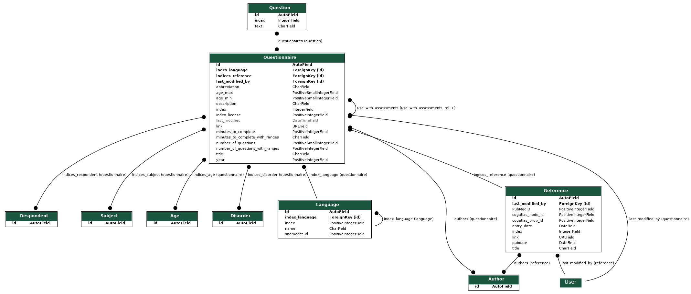

# mhdb-tables2api
___in progress___  

Convert MHDB google sheets spreadsheets to a postgres DB and Django Rest Framework API.

## Features
* download spreadsheets from the google sheets
* reformat into Django Fixtures
* run database in Docker

## To Do

[X] Set Up DRF boilerplate  
[X] Download google spreadsheets   
[ -> ] define schema & create models  
[  ] create fixtures to populate the database  
[  ] remove api/*/migrations from gitignore after initial dev is finished    
[  ] Add correct licence details    
[  ] dockerize rest api  
[  ] replace sqlite database with postgres  
[  ] see if GraphQL provides more flexible querying (see [django-restql](https://github.com/yezyilomo/django-restql))  
[  ] 

## Questions

_Q. Should we have an Authors Table or just in clude a text field?_  
A.

_Q. What data standards need to be enforced (allowing nulls, date field standards)?_  
A.

_Q. Do non-admin level requests require authentication?_  
A.

_Q. Beyond typical CRUD operations what custom queries are needed ?_  
A.


_Q. Should the DB track versions of questionaires? i.e. be able to look up how an assessment looked on a particular day_  
A.  

_Q. What are the Cogatlas_node and prop id columns in the references and tasks sheet?_  
A.

_Q. What are the 'Anirudh left' & 'Anirudh right' columns for?_  
A.

_Q. Should the strategy be to add the most important columns of each table, or methodically add everything for a single table?_  
A.  

_Q. what is the purpose of indices_language_not_in_mhdb?_  
A.  


## Current Schema

To update run

```bash
/api$ python manage.py graph_models assessments -o ../models.png
```



## Notes & references

http://www.codekoala.com/posts/using-django-design-your-database-schema/ 
