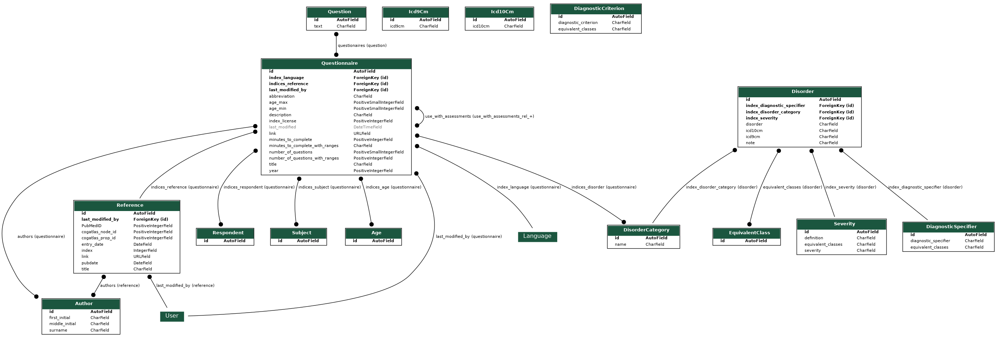

# mhdb-tables2api
___in early development__  

Convert MHDB google sheets spreadsheets to a postgres DB and Django Rest Framework API.

## Features
* download spreadsheets from the google sheets
* reformat into Django Fixtures
* run database in Docker

## To Run Locally

To start the development server locally; 
- clone this repo
- create a virtual env & run the following steps

```bash
$ pip install -f requirements.txt
$ cd api
api$ sh run.sh
```
for list of endpoints go to  
http://127.0.0.1:8000/api/v1   
or docs page  
http://127.0.0.1:8000/api/v1/docs   

If the fixtures (for populating the DB) have been created, they can be loaded as follows:

```bash
api$ python3 manage.py loaddata ../data-ingest/data/processed/fixtures/Language.json
```
### DVC
dvc is used to version control changes to the fixtures data. It's like git for data. Data and the git commits that produced that data should be kept in sync.  
`dvc pull` will pull latest data versions from the [remote store](https://drive.google.com/drive/folders/1px-GJG4NQl-k9dEFG9ol3U7189nMxVKq?usp=sharing) into the local repo (https://dvc.org/doc/start/data-versioning#retrieving)


after updating fixtures, they can added to the remote data store  
```bash
data-ingest/data/processed$ dvc add fixtures
data-ingest/data/processed$ dvc push
#then add reference file to git repo
data-ingest/data/processed$ git add -f fixtures.dvc
```  

## Current Schema

To update run

```bash
/api$ python manage.py graph_models assessments disorders -o ../models.png
```




## To Do

[X] Set Up DRF boilerplate  
[X] Download google spreadsheets   
[ -> ] define schema & create models  
[ -> ] create fixtures to populate the database  
[  ] remove api/*/migrations from gitignore after initial dev is finished    
[  ] remove browsable api i.e. set default render to json  
[  ] Add correct licence details  
[  ] dockerize rest api  
[  ] replace sqlite database with mysql  
[  ] see if GraphQL provides more flexible querying (see [django-restql](https://github.com/yezyilomo/django-restql))  
[  ] 


## Naming Conventions

**field/column names**: all  in tables are in **snake_case** *e.g. author_name*  
**models**: all models are in **CamelCase** in singular form (no plurals).  *e.g. a model defing a table for records of books is class Book(models.Model):*  
**urls**: endpoints for models are in **kebab-case** in singular form e.g.: *the model DisorderCategory has the url disorder-category*  

## Questions

**_Q.** In the signs_symptoms sheet of the disorders file, should the red and grey columns be included?_  
**A.** Let's discuss with Anirudh.

_**Q.** In the disorders sheet of the disorders file, do index_diagnostic_inclusion_criterion 1 & 2 have specific meanings? or is it just that disorders can have multiple inclusion & exclusion criteria? (In almost all other cases when there are multiple references to another sheet they have been entered as comma separated values in a cell, but in this case there are separate columns for index_diagnostic_inclusion_criterion_1  & index_diagnostic_inclusion_criterion_)_  
**A.**

_**Q.** Is it important to keep the history of the date fields (which show last modified)?_  
**A.** It would be good practice to record when (and in some cases who). 

_**Q.** Should the existing primary indices in the sheets be used as the primary keys in the DB?_  
**A.** Yes

_**Q.** Do non-admin level requests require authentication?_   
**A.**

_**Q.** Are there any particular data standards that need to be enforced (no nulls, date field standards)?_  
**A.** Anything consistent for dates; there will be a lot of empty entries.

_**Q.** Should the fields be renamed to a convention or keep the same for ease of reference (e.g.: index_language -> fk_language)?_  
**A.** for now, field names have been kept same as much as possible, but all snake_casing has been maintained throughout

_**Q.** Should the DB track versions of questionaires? i.e. be able to look up how an assessment looked on a particular day_  
**A.**  not necessary intially. We will just track the date that the assessment was last modified.

_**Q.** What are the Cogatlas_node and prop id columns in the references and tasks sheet?_  
**A.**  These are references to www.cognitiveatlas.org and can be ignored for now.

_**Q.** What are the 'Anirudh left' & 'Anirudh right' columns for?_   
**A.** these are rough work columns and can be ignored

_**Q.** what is the purpose of indices_language_not_in_mhdb?_   
**A.** These are languages that the assessment has been published in, but is not yet available in Mindlogger  

_**Q.** What do the colored columns indicate?_  
**A.**  there have been many different collaborators so there is not a consistent color scheme. It's best to ask about specific sheets in the MHDB slack channel.  

_**Q.** What are the grey columns indicating?_   
**A.** Column is not important and can be ommitted from the DB. It will be assumed that these columns may not exist in future spreadsheets

_**Q.** which sheets are most important?_  
**A.** Disorders, Asessments. Questionnaire, see Anirudh's google doc for more detailed


## Notes & references

http://www.codekoala.com/posts/using-django-design-your-database-schema/ 
